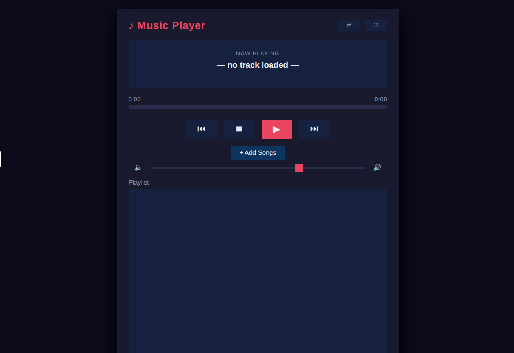

# 🎵 Music Player — Tkinter + Pygame

A desktop music player built with Python, Tkinter, and pygame. Supports playlists, shuffle, repeat, volume control, and a live progress bar.



---

## Features

### Version 1.0
- ✅ Browse and load MP3 / WAV / OGG / FLAC files
- ✅ Display song name
- ✅ Play, Pause, Resume, Stop

### Version 1.1
- ✅ Volume slider
- ✅ Song duration display
- ✅ Live progress bar
- ✅ Current playback time

### Version 2.0
- ✅ Playlist panel (add multiple songs)
- ✅ Next / Previous track
- ✅ Shuffle mode
- ✅ Repeat mode

---

## Installation

### 1. Clone the repository
```bash
git clone https://github.com/your-username/music-player-tkinter.git
cd music-player-tkinter
```

### 2. Create a virtual environment (recommended)
```bash
python -m venv venv

# Windows
venv\Scripts\activate

# macOS / Linux
source venv/bin/activate
```

### 3. Install dependencies
```bash
pip install -r requirements.txt
```

> **Note:** Tkinter is included with standard Python on Windows and macOS.  
> On Linux: `sudo apt-get install python3-tk`

---

## Running the App

```bash
python src/main.py
```

---

## Project Structure

```
music-player-tkinter/
│
├── README.md
├── requirements.txt
├── .gitignore
│
├── assets/
│   ├── icons/              # UI icons (optional PNG overrides)
│   └── screenshots/        # App screenshots for README
│
├── src/
│   ├── main.py             # Entry point — launches Tkinter window
│   ├── player.py           # MusicPlayer class — pygame audio engine
│   ├── gui.py              # MusicPlayerGUI class — full Tkinter UI
│   └── utils.py            # Stateless helpers (format, validate)
│
└── music/
    └── .gitkeep            # Drop your .mp3 test files here
```

---

## Dependencies

| Package   | Purpose                                 |
|-----------|-----------------------------------------|
| `pygame`  | Audio playback engine                   |
| `mutagen` | Reading MP3 duration metadata           |

Tkinter is part of the Python standard library — no install needed.

---

## Keyboard Shortcuts (planned v2.1)

| Key        | Action         |
|------------|----------------|
| `Space`    | Play / Pause   |
| `→`        | Next song      |
| `←`        | Previous song  |
| `↑` / `↓` | Volume up/down |

---

## Contributing

Pull requests are welcome. For major changes, open an issue first.

---

## License

[MIT](LICENSE)
